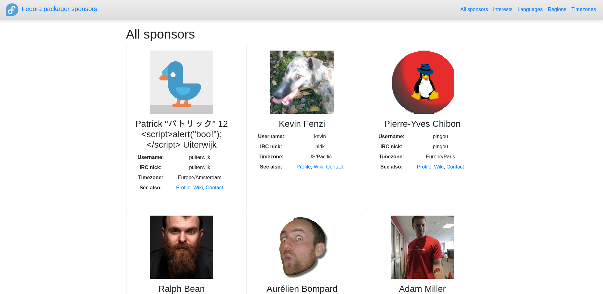
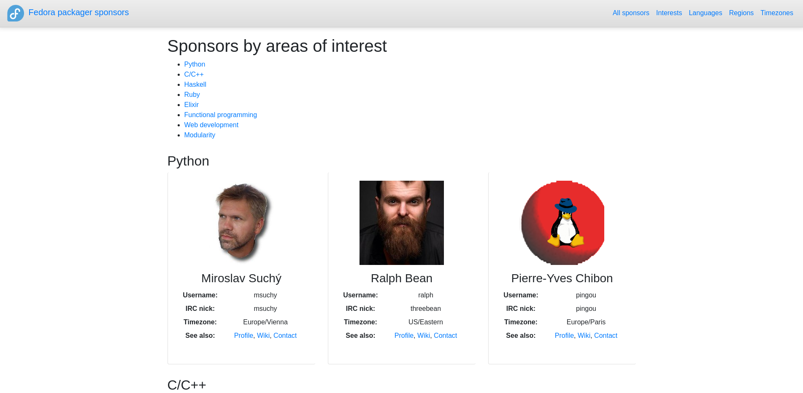

# Fedora Packager Sponsors

https://docs.pagure.org/fedora-sponsors

A static page displaying list of all current Fedora packager
sponsors.

## Features

- Displaying all sponsors
- Displaying sponsors divided into groups based on some criteria
  - Areas of interests / expertise
  - Native languages
  - Regions around the globe
  - Timezones


## What if I am a sponsor

If you are a Fedora packager sponsor, please make sure to configure
your areas of interests and your native languages. There are two
possible ways to do it, choose whichever you prefer.

In this repository, there are [interests.yaml][interests] and
[languages.yaml][languages] configuration files. Both use the same
format, e.g.

```yaml
- id: german
- id: swedish
- id: czech
```


### A) Use the upstream config

Find groups in the config that you would like to assign yourself to
and do it in the following fashion

```yaml
- id: czech
  users:
  - msuchy
  - frostyx
```


### B) Your personal config on fedorapeople.org

Every Fedora user has an access to their own web hosting on
http://fedorapeople.org . For more information, please read the
[official documentation][fedorapeople-docs].

Connect to your fedorapeople hosting and create the following file

```
$ ssh <USER>@fedorapeople.org
$ vim public_html/sponsor.yaml
```

Mine would look like this

```yaml
interests:
- modularity
- web
- command-line

languages:
- czech
```

The list items are ID keys from the [interests.yaml][interests] and
[languages.yaml][languages] files.

Please don't be concerned if you don't see your configuration
immediately propagated into the production instance. It is a
statically generated site, so your configuration will be used during
the next rebuild.


## Public API

All information that is visible on the website is also available via API.
Unfortunately, the format is inconsistent.

```bash
curl https://docs.pagure.org/fedora-sponsors/api/sponsors.json |jq
curl https://docs.pagure.org/fedora-sponsors/api/sponsors.list
curl https://docs.pagure.org/fedora-sponsors/api/active-sponsors.list
curl https://docs.pagure.org/fedora-sponsors/api/interests.yaml
curl https://docs.pagure.org/fedora-sponsors/api/languages.yaml
```


## Development

Create `~/.config/fedora` in the following format:

```
[main]
username = frostyx
password = mysecretpassword
```

Obtain the statistics about the latest sponsor activity

```
$ make activity
```

Obtain each and everyone's personal sponsor config from
fedorapeople.org

```
$ make groups
```

Fetch the up-to-date information about sponsors and build the page

```
$ make build
```

Navigate to `_build/html/index.html` in a web browser.


## Deployment

Deploy the latest build to production

```
$ make deploy
```

The production instance
https://docs.pagure.org/fedora-sponsors


## Deployment Automation

We have an automation set-up to rebuild the page weekly. There is a
script that clones this repository, builds everything, and deploys it
to the production, and runs some tests against that
build. Unfortunately, we don't have a staging instance, so we need to
run tests against the production, but better late than never. See

https://gist.github.com/FrostyX/13fdf75cdab40087087f0f22bb45fef7

It is executed weekly by Cron on my (@FrostyX) personal server. This
is not an exclusive way of re-building the page. Everybody (with the
correct permissions) can re-build the page, or set up their own
automatization.


## Screenshots

Page with all sponsors:



Page with grouped sponsors into the areas that they are interested in:




## See also

- [Improving Fedora sponsors discoverability][packager-sponsors-rfe]
- [Flock 2016 - Fedora sponsors, Miroslav Suchý][msuchy-flock]
- [Mailing list thread][mailing-list-thread]


[packager-sponsors-rfe]: https://pagure.io/packager-sponsors/issue/470
[msuchy-flock]: https://www.youtube.com/watch?v=yBjPLrD77p4
[mailing-list-thread]: https://lists.fedoraproject.org/archives/list/devel@lists.fedoraproject.org/thread/IISNS57OVFFGPCZWUPZGZXUVBAMW74VZ/
[interests]: https://github.com/FrostyX/fedora-sponsors/blob/main/interests.yaml
[languages]: https://github.com/FrostyX/fedora-sponsors/blob/main/languages.yaml
[fedorapeople-docs]: https://fedoraproject.org/wiki/Infrastructure/fedorapeople.org
